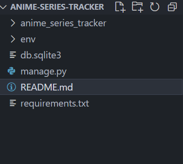

# Anime-Tracker

## Tugas 2

 - [x] Membuat sebuah proyek Django baru

Untuk Membuat sebuah proyek baru pada django, kita perlu membuka terminal pada path folder direktori, pertama kita perlu membuat folder direktori utama yang menampung semua file projek kita, sebelum itu kita perlu membuat virtual environmet pada folder projek kita dengan perintah

```
python -m venv env
```

kemudian mengaktifkan virtual environmet di terminal dengan perintah

```
env\Scripts\activate
```

kemudian tampilan pada terminal akan menjadi seperti ini

```
(env) D:\UI\PBP\anime-series-tracker> 
```

kemudian kita menyiapkan depedencies yang kita perlukan untuk menginisialisasi projek dengan membuat file requirements.txt, yang isinya

```
django
gunicorn
whitenoise
psycopg2-binary
requests
urllib3
```
Kemudian melakukan instalasi django dengan mengetikkan perintah
```
pip install -r requirements.txt
```
Setelah proses instalasi selesai, kemudian kita membuat aplikasi projek django yang akan kita buat, dengan mengetikkan perintah
```
django-admin startproject anime_tracker
```
Tampilan direktori akan jadi seperti ini:



 - [x]  Membuat aplikasi dengan nama main pada proyek tersebut.
 
Kemudian untuk membuat aplikasi main yang berisi Models, View, Template dengan menggunakan perintah ini pada terminal di direktori utama

```
python manage.py startapp main
```

Untuk memasukkan aplikasi main sebagai bagian dari anime_series tracker lakukan konfigurasi dengan menambahkan 'main' pada settings.py di dalam direktori proyek anime_series_tracker 

```
INSTALLED_APPS = [
    'main',
    'django.contrib.admin',
    'django.contrib.auth',
    'django.contrib.contenttypes',
    'django.contrib.sessions',
    'django.contrib.messages',
    'django.contrib.staticfiles',
]
```

- [x] Melakukan routing pada proyek agar dapat menjalankan aplikasi main.
  
untuk menambahkan routing ke proyek main, kita perlu mengimpor fungsi include() dari django.urls kemudian mengubah path pada urls.py 

```
urlpatterns = [
    ...
    path('', include('main.urls')),
    ...
]
```
path('') tidak diisi karena untuk menginisialisasi route pada halaman utam dari aplikasi, kemudian menambahkan route aplikasi ke aplikasi main


- [x] Membuat model pada aplikasi main dengan nama Item dan memiliki atribut wajib sebagai berikut.

- name sebagai nama item dengan tipe CharField.
- amount sebagai jumlah item dengan tipe IntegerField.
- description sebagai deskripsi item dengan tipe TextField.
  
Anime tracker disini akan membuat model dengan field name sebagai nama item dengan tipe CharField, episodes sebagai item amount dengan IntegerField, dan synopsis sebagai item description dengan Textfield

Kemudian ada atribut-atribut tambahan pada field yaitu rating, studio, genre, dan release date

```
from django.db import models

# Create your models here.

class Anime(models.Model):
    name = models.CharField(max_length=255)
    episodes = models.IntegerField()
    synopsis = models.TextField()
    rating = models.FloatField()
    studio = models.CharField(max_length=255)
    genre = models.CharField(max_length=255)
    release_date = models.DateField()
```

- [x] Membuat sebuah fungsi pada views.py untuk dikembalikan ke dalam sebuah template HTML yang menampilkan nama aplikasi serta nama dan kelas kamu.

disini kita akan mengimpor modul dengan fungsi show_main yang terintegrasi dengan routing proyek main lalu menambahkan fungsi :

```
def show_main(request):
    context = {
        'name': 'Muhammad Eagel Triutama',
        'class': 'PBP A'
    }

    return render(request, "main.html", context)
```

kemudian pada direktori main kita akan menambahkan direktori main, lalu menambahkan file html dengan nama main.html, lalu menghubungkan dengan variabel context yang ada show_main

```
<h5>Name:</h5>
<p>{{ name }}</p>
<p></p>
<h5>Class:</h5>
<p>{{ class }}</p>
```

- [x] Membuat sebuah routing pada urls.py aplikasi main untuk memetakan fungsi yang telah dibuat pada views.py

untuk membuat routing pada aplikasi main yaitu dengan membuat routes.py pada direktori aplikasi main kemudian menghubungkan juga dengan fungsi show_main

```
from django.urls import path
from main.views import show_main

app_name = 'main'

urlpatterns = [
    path('', show_main, name='show_main'),
]
```

- [x] Melakukan deployment ke PWS terhadap aplikasi yang sudah dibuat sehingga nantinya dapat diakses oleh teman-temanmu melalui Internet.
- [x]  Membuat sebuah README.md yang berisi tautan menuju aplikasi PWS yang sudah di-deploy, serta jawaban dari beberapa pertanyaan berikut. 


 ## Soal

- Buatlah bagan yang berisi request client ke web aplikasi berbasis Django beserta responnya dan jelaskan pada bagan tersebut kaitan antara urls.py, views.py, models.py, dan berkas html.

```

```

- Jelaskan mengapa kita menggunakan virtual environment? Apakah kita tetap dapat membuat aplikasi web berbasis Django tanpa menggunakan virtual environment?

> Virtual environtment digunakan untuk mengisolasi depedensi proyek yang mana setiap proyek python memiliki depedensi dan library sendiri yang mungkin berbeda dengan proyek lainnya, yang mana hal ini berguna untuk menghindari konflik depedensi antara proyek satu dengan proyek lain, dalam menjalankan aplikasi web berbasis django tanpa menggunakan virtual environtment itu memungkinkan yaitu dengan menginstall django package secara systemwide yang tidak direkomendasikan karena akan konflik versi dan permasalahan pada depedensi system-level, caranya yaitu dengan mengetikkan "python -m install Django" dan membuat projek dengan mengetikkan perintah "django-admin startproject 'nama proyek' "

- Jelaskan apakah itu MVC, MVT, MVVM dan perbedaan dari ketiganya.

> MVC, MVT, dan MVVM merupakan pola design yang dirancang untuk memisahkan beberapa bagian dan bagian-bagian tersebut menangani masalah-masalah tertentu.

> MVC (Model View Controller) adalah pola design dengan Model sebagai bagian yang mengatur dan melakukan proses manajemen data, View sebagai bagian yang akan menampilkan visual atau tampilan kepada user atau client, dan Controller sebagai bagian yang memanipulasi Model dan menampilkan data ke bagian View atau menjembatani antara Model dan View

> MVT (Model View Template) adalah pola design dari django yang memiliki hampir sama dengan MVC, perbedaan yang kontras antara MVT dan MVC adalah Controller dari MVT dikelola oleh framework django itu sendiri. 
> <br> <br> Model pada MVT berperan sebagai antarmuka dan manajamen data pada aplikasi pada web application, bagian ini akan dihubungkan dengan database seperti MySql ataupun PostgreSQL,
> <br> <br> View pada MVT berinteraksi dengan Model dan akan melakukan proses render ke bagian Template sehingga View pada MVT itu merupakan controller dalam pola design MVC, yang mana akan menerima HTTP Request dan melakukan HTTP Response
> <br><br> Templates pada MVT merupakan bagian yang memberikan visual atau tampilan pada aplikasi, Template merupakan file HTML yang bersifat stasis ataupun dinamis

> MVVM (Model View ViewModel) adalah pola design aplikasi yang berbasis GUI, biasanya digunakan pada pembuatan aplikasi mobile
> <br> <br> Model pada MVVM merupakan bagian yang merepresentasikan data yang didalamnya terdapat kelas-kelas data
> <br> <br> View pada MVVM merupakan layer yang berisi UI (User Interface) atau yang mengatur bagaimana informasi ditampilka ke client atau user
> <br> <br> ViewModel pada MVVM bertugas untuk interaksi dengan model dan meneruskan data ke bagian View

### MVC VS MVT

| MVC                                                              | MVT                                                                                                                               |
| ---------------------------------------------------------------- | --------------------------------------------------------------------------------------------------------------------------------- |
| **Controller** berperan sebagai penghubung antara Model dan View | **View** berperan sebagai penghubung antara Model dan Template, yang mana akan menerima HTTP Request dan memberikan HTTP Response |
| **View** berperan dalam menampilkan data dari model              | **Templates** berperan dalam menampilkan data dari model                                                                          |
| Sulit untuk melakukan modifikasi | Mudah untuk melakukan modifikasi |
| Tidak berkaitan dengan mapping URL | Berkaitan dengan Mapping URL |

### MVC VS MVVM

| MVC                                                              | MVVM                                                                                                                               |
| ---------------------------------------------------------------- | --------------------------------------------------------------------------------------------------------------------------------- |
|Membagi infrastuktur design menjadi 3 bagian yang terhubung satu sama lain Model, View, dan Controller| Infrastuktur design dibangun menggunakan GUI atau Graphical User Interface |
|Koneksi antara controller dan view dibangun dengan konsep multiple to single| Koneksi one to many dibangun oleh view |
**Controller** berperan dalam membangun manajemen koneksi antar View dan Model| **ViewModel** berperan dalam membangun manajemen koneksi antara View dan Model |


## Tugas 3

- [x] Membuat input form untuk menambahkan objek model pada app sebelumnya. 

Untuk membuat form pada aplikasi kita perlu membuat file forms.py pada direktori main, kemudian mengimport ModelForm dari django.forms kemudian membuat class AnimeForm dengan fields sesuai dengan model yang sudah dibuat yaitu name, episodes, synopsis, rating, studio, genre, dan release_date

```
from django.forms import ModelForm
from main.models import Anime

class AnimeForm(ModelForm):
    class Meta:
        model = Anime
        fields = ["name", "episodes", "synopsis", "rating", "studio", "genre", "release_date"]
```
kemudian mengimport redirect pada views.py yang ada pada folder main
```
from django.shortcuts import render, redirect 
```
kemudian menambahkan fungsi create_anime yang menerima parameter request pada views.py yang akan menambahkan data ketika form disubmit

```
def create_anime(request):
    form = AnimeForm(request.POST or None)

    if form.is_valid() and request.method == "POST":
        form.save()
        return redirect('main:show_main')

    context = {'form': form}
    return render(request, "create_anime.html", context)
```
kemudian mengirim data atau objek-objek yang sudah dibuat sebagai context agar bisa ditampilkan di halaman dengan menambahkannya pada context di fungsi show_main

```
def show_main(request):
    allAnime = Anime.objects.all()
    context = {
        'name': 'Muhammad Eagel Triutama',
        'class': 'PBP A',
        'allAnime': allAnime
        
    }

    return render(request, "main.html", context)
```

- [x] Tambahkan 4 fungsi views baru untuk melihat objek yang sudah ditambahkan dalam format XML, JSON, XML by ID, dan JSON by ID.

Untuk menampilkan objek yang telah kita buat dengan menginputkan data melalui form yang sudah kita buat dalam format XML ataupun JSON, kita perlu menginport HttpResponse dari django.http dan serializers dadri django.core untuk memberikan http response kemudian mentranslate objek model menjadi format XML ataupun JSON pada Views.py pada direktori main

```
from django.http import HttpResponse
from django.core import serializers
```

kemudian untuk menangkap dan menampilkan semua data dari objek yang telah kita buat dengan cara menggunakan fungsi all kemudian disimpan kedalam variabel data
```
data = Anime.objects.all()
```
kemudian membuat fungsi show_xml untuk menampilkan data xml menggunakan serializer dan HttpResponse

```
def show_xml(request):
    data = Anime.objects.all()
    return HttpResponse(serializers.serialize("xml", data), content_type="application/xml")

```

kemudian membuat fungsi show_json untuk menampilkan data json menggunakan serializer dan HttpResponse

```
def show_json(request):
    data = Anime.objects.all()
    return HttpResponse(serializers.serialize("json", data), content_type="application/json")

```

Untuk menangkap data objek berdasarkan id kita menggunakan fungsi filter() agar mengfilter berdasarkan id yang ada pada objeknya

```
data = Anime.objects.filter(pk=id)
```

kemudian membuat fungsi show_xml_by_id dan show_json_by_id untuk menampilkan data pada templates menggunakan httpresponse dan serializer
```
def show_xml_by_id(request, id):
    data = Anime.objects.filter(pk=id)
    return HttpResponse(serializers.serialize("xml", data), content_type="application/xml")

```
```
def show_json_by_id(request, id):
    data = Anime.objects.filter(pk=id)
    return HttpResponse(serializers.serialize("json", data), content_type="application/json")

```

- [x] Membuat routing URL untuk masing-masing views yang telah ditambahkan pada poin 2.

Agar Fungsi untuk menunjukkan data berdasarkan xml dan json tampil pada aplikasi yang kita buat, kita perlu melakukan routing url dengan mengedit urls.py pada direktori main dengan mengimport setiap fungsi yang sudah kita buat, kemudian membuat path nya masing-masing, sehingga bisa diakses dengan mengetikkan alamat /json/ atau /xml/
```
from main.views import show_main, create_anime, show_xml, show_json, show_xml_by_id, show_json_by_id

app_name = 'main'

urlpatterns = [
    path('', show_main, name='show_main'),
    path('create-anime', create_anime, name='create_anime'),
    path('xml/', show_xml, name='show_xml'), 
    path('json/', show_json, name='show_json'),
    path('xml/<int:id>/', show_xml_by_id, name='show_xml_by_id'),
    path('json/<int:id>/', show_json_by_id, name='show_json_by_id'),

]
```

### Pertanyaan 
1. Apa perbedaan antara form POST dan form GET dalam django?

-  form POST django akan mengirimkan data dari form yang kita isi ke server bisa dalam bentuk JSON maupun XML, dan kemudian client akan mendapatkan response dari server sedangkan form GET django akan menerima data yang dikirim ke dalam bentuk string kemudian string tersebut akan digunakan untuk URL.
  
2. Apa perbedaan utama antara XML, JSON, dan HTML dalam konteks pengiriman data?

- Dalam pengiriman data XML, JSON, dan HTML memiliki representasi data yang berbeda-beda, JSON memiliki bentuk yang mirip dengan tipe data dictionary atau tipe data objek. XML memiliki bentuk seperti struktur tree yang hampir sama dengan HTML, tree dimulai dengan elemen root sebelum memberikan informasi tentang elemen childnya, JSON dan XML masih berbentuk data yang akan dikirim untuk ditampilkan ke dalam HTML. HTML sendiri digunakan untuk menampilkan data yang diterimanya baik itu XML ataupun JSON agar dapat dilihat oleh client sebagai bentuk informasi yang utuh.

3.  Mengapa JSON sering digunakan dalam pertukaran data antara aplikasi web modern?

- JSON tidak tergantung pada bahasa pemrograman apapun karena menggunakan gaya bahasa yang umum digunakan, juga JSON memiliki bentuk yang tidak bertele-tele layaknya XML yang terdiri dari banyak elemen root.


- [x] Mengakses keempat URL di poin 2 menggunakan Postman, membuat screenshot dari hasil akses URL pada Postman, dan menambahkannya ke dalam README.md.


#### localhost:8000/json


#### localhost:8000/json/3


### localhost:8000/xml


### localhost:8000/xml/2


