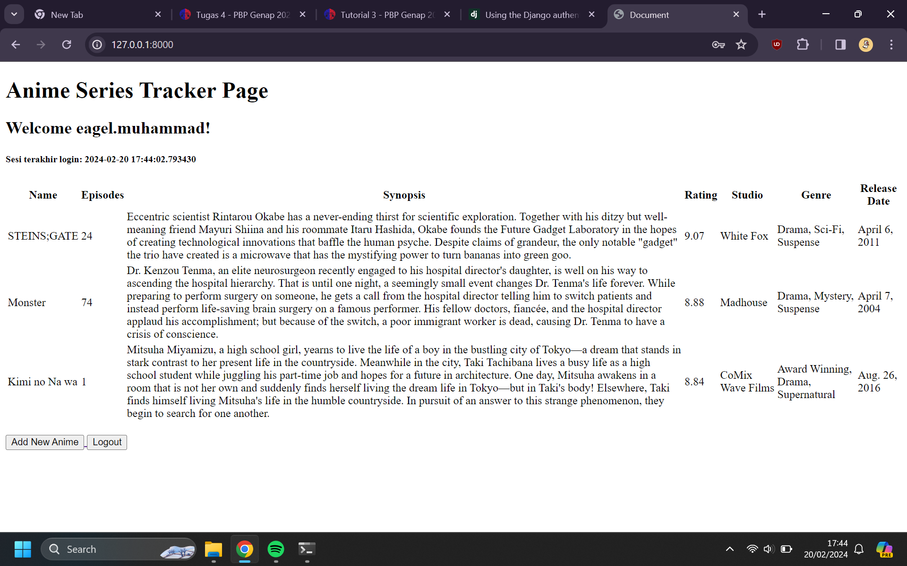

# Anime-Tracker

## Tugas 2

 - [x] Membuat sebuah proyek Django baru

Untuk Membuat sebuah proyek baru pada django, kita perlu membuka terminal pada path folder direktori, pertama kita perlu membuat folder direktori utama yang menampung semua file projek kita, sebelum itu kita perlu membuat virtual environmet pada folder projek kita dengan perintah

```
python -m venv env
```

kemudian mengaktifkan virtual environmet di terminal dengan perintah

```
env\Scripts\activate
```

kemudian tampilan pada terminal akan menjadi seperti ini

```
(env) D:\UI\PBP\anime-series-tracker> 
```

kemudian kita menyiapkan depedencies yang kita perlukan untuk menginisialisasi projek dengan membuat file requirements.txt, yang isinya

```
django
gunicorn
whitenoise
psycopg2-binary
requests
urllib3
```
Kemudian melakukan instalasi django dengan mengetikkan perintah
```
pip install -r requirements.txt
```
Setelah proses instalasi selesai, kemudian kita membuat aplikasi projek django yang akan kita buat, dengan mengetikkan perintah
```
django-admin startproject anime_tracker
```
Tampilan direktori akan jadi seperti ini:


 - [x]  Membuat aplikasi dengan nama main pada proyek tersebut.
 
Kemudian untuk membuat aplikasi main yang berisi Models, View, Template dengan menggunakan perintah ini pada terminal di direktori utama

```
python manage.py startapp main
```

Untuk memasukkan aplikasi main sebagai bagian dari anime_series tracker lakukan konfigurasi dengan menambahkan 'main' pada settings.py di dalam direktori proyek anime_series_tracker 

```
INSTALLED_APPS = [
    'main',
    'django.contrib.admin',
    'django.contrib.auth',
    'django.contrib.contenttypes',
    'django.contrib.sessions',
    'django.contrib.messages',
    'django.contrib.staticfiles',
]
```

- [x] Melakukan routing pada proyek agar dapat menjalankan aplikasi main.
  
untuk menambahkan routing ke proyek main, kita perlu mengimpor fungsi include() dari django.urls kemudian mengubah path pada urls.py 

```
urlpatterns = [
    ...
    path('', include('main.urls')),
    ...
]
```
path('') tidak diisi karena untuk menginisialisasi route pada halaman utam dari aplikasi, kemudian menambahkan route aplikasi ke aplikasi main


- [x] Membuat model pada aplikasi main dengan nama Item dan memiliki atribut wajib sebagai berikut.

- name sebagai nama item dengan tipe CharField.
- amount sebagai jumlah item dengan tipe IntegerField.
- description sebagai deskripsi item dengan tipe TextField.
  
Anime tracker disini akan membuat model dengan field name sebagai nama item dengan tipe CharField, episodes sebagai item amount dengan IntegerField, dan synopsis sebagai item description dengan Textfield

Kemudian ada atribut-atribut tambahan pada field yaitu rating, studio, genre, dan release date

```
from django.db import models

# Create your models here.

class Anime(models.Model):
    name = models.CharField(max_length=255)
    episodes = models.IntegerField()
    synopsis = models.TextField()
    rating = models.FloatField()
    studio = models.CharField(max_length=255)
    genre = models.CharField(max_length=255)
    release_date = models.DateField()
```

- [x] Membuat sebuah fungsi pada views.py untuk dikembalikan ke dalam sebuah template HTML yang menampilkan nama aplikasi serta nama dan kelas kamu.

disini kita akan mengimpor modul dengan fungsi show_main yang terintegrasi dengan routing proyek main lalu menambahkan fungsi :

```
def show_main(request):
    context = {
        'name': 'Muhammad Eagel Triutama',
        'class': 'PBP A'
    }

    return render(request, "main.html", context)
```

kemudian pada direktori main kita akan menambahkan direktori main, lalu menambahkan file html dengan nama main.html, lalu menghubungkan dengan variabel context yang ada show_main

```
<h5>Name:</h5>
<p>{{ name }}</p>
<p></p>
<h5>Class:</h5>
<p>{{ class }}</p>
```

- [x] Membuat sebuah routing pada urls.py aplikasi main untuk memetakan fungsi yang telah dibuat pada views.py

untuk membuat routing pada aplikasi main yaitu dengan membuat routes.py pada direktori aplikasi main kemudian menghubungkan juga dengan fungsi show_main

```
from django.urls import path
from main.views import show_main

app_name = 'main'

urlpatterns = [
    path('', show_main, name='show_main'),
]
```

- [x] Melakukan deployment ke PWS terhadap aplikasi yang sudah dibuat sehingga nantinya dapat diakses oleh teman-temanmu melalui Internet.
- [x]  Membuat sebuah README.md yang berisi tautan menuju aplikasi PWS yang sudah di-deploy, serta jawaban dari beberapa pertanyaan berikut. 


 ## Soal

- Buatlah bagan yang berisi request client ke web aplikasi berbasis Django beserta responnya dan jelaskan pada bagan tersebut kaitan antara urls.py, views.py, models.py, dan berkas html.

```

```

- Jelaskan mengapa kita menggunakan virtual environment? Apakah kita tetap dapat membuat aplikasi web berbasis Django tanpa menggunakan virtual environment?

> Virtual environtment digunakan untuk mengisolasi depedensi proyek yang mana setiap proyek python memiliki depedensi dan library sendiri yang mungkin berbeda dengan proyek lainnya, yang mana hal ini berguna untuk menghindari konflik depedensi antara proyek satu dengan proyek lain, dalam menjalankan aplikasi web berbasis django tanpa menggunakan virtual environtment itu memungkinkan yaitu dengan menginstall django package secara systemwide yang tidak direkomendasikan karena akan konflik versi dan permasalahan pada depedensi system-level, caranya yaitu dengan mengetikkan "python -m install Django" dan membuat projek dengan mengetikkan perintah "django-admin startproject 'nama proyek' "

- Jelaskan apakah itu MVC, MVT, MVVM dan perbedaan dari ketiganya.

> MVC, MVT, dan MVVM merupakan pola design yang dirancang untuk memisahkan beberapa bagian dan bagian-bagian tersebut menangani masalah-masalah tertentu.

> MVC (Model View Controller) adalah pola design dengan Model sebagai bagian yang mengatur dan melakukan proses manajemen data, View sebagai bagian yang akan menampilkan visual atau tampilan kepada user atau client, dan Controller sebagai bagian yang memanipulasi Model dan menampilkan data ke bagian View atau menjembatani antara Model dan View

> MVT (Model View Template) adalah pola design dari django yang memiliki hampir sama dengan MVC, perbedaan yang kontras antara MVT dan MVC adalah Controller dari MVT dikelola oleh framework django itu sendiri. 
> <br> <br> Model pada MVT berperan sebagai antarmuka dan manajamen data pada aplikasi pada web application, bagian ini akan dihubungkan dengan database seperti MySql ataupun PostgreSQL,
> <br> <br> View pada MVT berinteraksi dengan Model dan akan melakukan proses render ke bagian Template sehingga View pada MVT itu merupakan controller dalam pola design MVC, yang mana akan menerima HTTP Request dan melakukan HTTP Response
> <br><br> Templates pada MVT merupakan bagian yang memberikan visual atau tampilan pada aplikasi, Template merupakan file HTML yang bersifat stasis ataupun dinamis

> MVVM (Model View ViewModel) adalah pola design aplikasi yang berbasis GUI, biasanya digunakan pada pembuatan aplikasi mobile
> <br> <br> Model pada MVVM merupakan bagian yang merepresentasikan data yang didalamnya terdapat kelas-kelas data
> <br> <br> View pada MVVM merupakan layer yang berisi UI (User Interface) atau yang mengatur bagaimana informasi ditampilka ke client atau user
> <br> <br> ViewModel pada MVVM bertugas untuk interaksi dengan model dan meneruskan data ke bagian View

### MVC VS MVT

| MVC                                                              | MVT                                                                                                                               |
| ---------------------------------------------------------------- | --------------------------------------------------------------------------------------------------------------------------------- |
| **Controller** berperan sebagai penghubung antara Model dan View | **View** berperan sebagai penghubung antara Model dan Template, yang mana akan menerima HTTP Request dan memberikan HTTP Response |
| **View** berperan dalam menampilkan data dari model              | **Templates** berperan dalam menampilkan data dari model                                                                          |
| Sulit untuk melakukan modifikasi | Mudah untuk melakukan modifikasi |
| Tidak berkaitan dengan mapping URL | Berkaitan dengan Mapping URL |

### MVC VS MVVM

| MVC                                                              | MVVM                                                                                                                               |
| ---------------------------------------------------------------- | --------------------------------------------------------------------------------------------------------------------------------- |
|Membagi infrastuktur design menjadi 3 bagian yang terhubung satu sama lain Model, View, dan Controller| Infrastuktur design dibangun menggunakan GUI atau Graphical User Interface |
|Koneksi antara controller dan view dibangun dengan konsep multiple to single| Koneksi one to many dibangun oleh view |
**Controller** berperan dalam membangun manajemen koneksi antar View dan Model| **ViewModel** berperan dalam membangun manajemen koneksi antara View dan Model |


## Tugas 3

- [x] Membuat input form untuk menambahkan objek model pada app sebelumnya. 

Untuk membuat form pada aplikasi kita perlu membuat file forms.py pada direktori main, kemudian mengimport ModelForm dari django.forms kemudian membuat class AnimeForm dengan fields sesuai dengan model yang sudah dibuat yaitu name, episodes, synopsis, rating, studio, genre, dan release_date

```
from django.forms import ModelForm
from main.models import Anime

class AnimeForm(ModelForm):
    class Meta:
        model = Anime
        fields = ["name", "episodes", "synopsis", "rating", "studio", "genre", "release_date"]
```
kemudian mengimport redirect pada views.py yang ada pada folder main
```
from django.shortcuts import render, redirect 
```
kemudian menambahkan fungsi create_anime yang menerima parameter request pada views.py yang akan menambahkan data ketika form disubmit

```
def create_anime(request):
    form = AnimeForm(request.POST or None)

    if form.is_valid() and request.method == "POST":
        form.save()
        return redirect('main:show_main')

    context = {'form': form}
    return render(request, "create_anime.html", context)
```
kemudian mengirim data atau objek-objek yang sudah dibuat sebagai context agar bisa ditampilkan di halaman dengan menambahkannya pada context di fungsi show_main

```
def show_main(request):
    allAnime = Anime.objects.all()
    context = {
        'name': 'Muhammad Eagel Triutama',
        'class': 'PBP A',
        'allAnime': allAnime
        
    }

    return render(request, "main.html", context)
```

- [x] Tambahkan 4 fungsi views baru untuk melihat objek yang sudah ditambahkan dalam format XML, JSON, XML by ID, dan JSON by ID.

Untuk menampilkan objek yang telah kita buat dengan menginputkan data melalui form yang sudah kita buat dalam format XML ataupun JSON, kita perlu menginport HttpResponse dari django.http dan serializers dadri django.core untuk memberikan http response kemudian mentranslate objek model menjadi format XML ataupun JSON pada Views.py pada direktori main

```
from django.http import HttpResponse
from django.core import serializers
```

kemudian untuk menangkap dan menampilkan semua data dari objek yang telah kita buat dengan cara menggunakan fungsi all kemudian disimpan kedalam variabel data
```
data = Anime.objects.all()
```
kemudian membuat fungsi show_xml untuk menampilkan data xml menggunakan serializer dan HttpResponse

```
def show_xml(request):
    data = Anime.objects.all()
    return HttpResponse(serializers.serialize("xml", data), content_type="application/xml")

```

kemudian membuat fungsi show_json untuk menampilkan data json menggunakan serializer dan HttpResponse

```
def show_json(request):
    data = Anime.objects.all()
    return HttpResponse(serializers.serialize("json", data), content_type="application/json")

```

Untuk menangkap data objek berdasarkan id kita menggunakan fungsi filter() agar mengfilter berdasarkan id yang ada pada objeknya

```
data = Anime.objects.filter(pk=id)
```

kemudian membuat fungsi show_xml_by_id dan show_json_by_id untuk menampilkan data pada templates menggunakan httpresponse dan serializer
```
def show_xml_by_id(request, id):
    data = Anime.objects.filter(pk=id)
    return HttpResponse(serializers.serialize("xml", data), content_type="application/xml")

```
```
def show_json_by_id(request, id):
    data = Anime.objects.filter(pk=id)
    return HttpResponse(serializers.serialize("json", data), content_type="application/json")

```

- [x] Membuat routing URL untuk masing-masing views yang telah ditambahkan pada poin 2.

Agar Fungsi untuk menunjukkan data berdasarkan xml dan json tampil pada aplikasi yang kita buat, kita perlu melakukan routing url dengan mengedit urls.py pada direktori main dengan mengimport setiap fungsi yang sudah kita buat, kemudian membuat path nya masing-masing, sehingga bisa diakses dengan mengetikkan alamat /json/ atau /xml/
```
from main.views import show_main, create_anime, show_xml, show_json, show_xml_by_id, show_json_by_id

app_name = 'main'

urlpatterns = [
    path('', show_main, name='show_main'),
    path('create-anime', create_anime, name='create_anime'),
    path('xml/', show_xml, name='show_xml'), 
    path('json/', show_json, name='show_json'),
    path('xml/<int:id>/', show_xml_by_id, name='show_xml_by_id'),
    path('json/<int:id>/', show_json_by_id, name='show_json_by_id'),

]
```

### Pertanyaan 
1. Apa perbedaan antara form POST dan form GET dalam django?

-  form POST django akan mengirimkan data dari form yang kita isi ke server bisa dalam bentuk JSON maupun XML, dan kemudian client akan mendapatkan response dari server sedangkan form GET django akan menerima data yang dikirim ke dalam bentuk string kemudian string tersebut akan digunakan untuk URL.
  
2. Apa perbedaan utama antara XML, JSON, dan HTML dalam konteks pengiriman data?

- Dalam pengiriman data XML, JSON, dan HTML memiliki representasi data yang berbeda-beda, JSON memiliki bentuk yang mirip dengan tipe data dictionary atau tipe data objek. XML memiliki bentuk seperti struktur tree yang hampir sama dengan HTML, tree dimulai dengan elemen root sebelum memberikan informasi tentang elemen childnya, JSON dan XML masih berbentuk data yang akan dikirim untuk ditampilkan ke dalam HTML. HTML sendiri digunakan untuk menampilkan data yang diterimanya baik itu XML ataupun JSON agar dapat dilihat oleh client sebagai bentuk informasi yang utuh.

3.  Mengapa JSON sering digunakan dalam pertukaran data antara aplikasi web modern?

- JSON tidak tergantung pada bahasa pemrograman apapun karena menggunakan gaya bahasa yang umum digunakan, juga JSON memiliki bentuk yang tidak bertele-tele layaknya XML yang terdiri dari banyak elemen root.


- [x] Mengakses keempat URL di poin 2 menggunakan Postman, membuat screenshot dari hasil akses URL pada Postman, dan menambahkannya ke dalam README.md.


#### localhost:8000/json


#### localhost:8000/json/3


### localhost:8000/xml


### localhost:8000/xml/2


## Tugas 4
- [x] Mengimplementasikan fungsi registrasi, login, dan logout untuk memungkinkan pengguna untuk mengakses aplikasi sebelumnya dengan lancar.

- [x] Membuat dua akun pengguna dengan masing-masing tiga dummy data menggunakan model buku yang telah dibuat pada aplikasi sebelumnya untuk setiap akun di lokal.

- [x] Menghubungkan model Item dengan User.

- [x] Menampilkan detail informasi pengguna yang sedang logged in seperti username dan menerapkan cookies seperti last login pada halaman utama aplikasi.

- [x]  Menjawab beberapa pertanyaan berikut pada README.md pada root folder (silakan modifikasi README.md yang telah kamu buat sebelumnya; tambahkan subjudul untuk setiap tugas).
  - [x] Apa itu Django UserCreationForm, dan jelaskan apa kelebihan dan kekurangannya?
  <br><br>
    Django UserCreationForm merupakan class dari django yang dapat digunakan untuk membuat user baru dari sebuah aplikasi web yang kita buat. Dalam formnya terdapat 3 field yatiu field username, password1, dan password2(field untuk konfirmasi password). Kelebihan dari Django UserCreationForm bisa dengan melakukan request data dari user untuk ditampilkan pada browser dan tidak perlu membuat class form kita sendiri karena sudah disedikan oleh Django. Namun, kekurangannya yaitu pilihan field yang terbatas atau kustomisasi yang terbatas, kita tidak bisa melakukan verifikasi email user karena field tersebut tidak tersedia.

  - [x] Apa perbedaan antara autentikasi dan otorisasi dalam konteks Django, dan mengapa keduanya penting?
  <br><br>
  Dalam sistem autentikasi pada Django, Django dapat mengatur atau memanajemen baik itu autentikasi dan autorisasi. Autentikasi sendiri adalah proses verifikasi identitas dari user atau pengguna dari aplikasi Django, sedangkan autorisasi adalah proses menentukan hak akses dari seorang user atau pengguna. Sistem autentikasi dan otorisasi pada Django terdiri dari:
  - Users / Pengguna
  - Permissions : berisi binary (yes / no) untuk menetukan apakah user boleh melakukan suatu task pada aplikasi
  - Forms and View Tools
  - Configurable password hashing system
  - Pluggable backend system

  - [x] Apa itu cookies dalam konteks aplikasi web, dan bagaimana Django menggunakan cookies untuk mengelola data sesi pengguna?
  <br><br>
  Cookies sendiri adalah kumpulan data yang diterima komputer dari sebuah situs yang mengirimkan kembali ke situs yang dikunjungi, sehingga website bisa menyimpan jejak dan aktivitas yang dilakukan user atau pengguna, di Django untuk menyimpan cookie pada website kita hanya perlu memberikan perintah
  ```
  set_cookie(<key value>, <value>)  
  ```
  - [x] Apakah penggunaan cookies aman secara default dalam pengembangan web, atau apakah ada risiko potensial yang harus diwaspadai?
  <br><br>
  Suatu cookie dari sebuah website yang terpercaya aman untuk diterima. Cookies biasanya hanya digunakan untuk menyimpan user preference, membuat pengalaman browsing pada website lebih smooth, dan proses autentikasi. Cookie sendiri tidak bisa digunakan untuk mendownload malicious software atau software yang berbahaya ataupun mencurigakan. Namun cookie sendiri dapat memancing tindakan cookie poisoning, penyerang dapat mendapatkan hak akses dari pengguna yang terkena cookie poisoning.

  - [x] Jelaskan bagaimana cara kamu mengimplementasikan checklist di atas secara step-by-step (bukan hanya sekadar mengikuti tutorial).

  
Untuk Membuat fungsi registrasi, login, dan logout kita perlu mengimport Django UserCreationForm yang akan kita gunakan untuk mengrender form template dari django yang terdiri dari 3 field username, password, dan confirmation password. Kemudian kita juga akan mengimport redirect serta messages untuk memunculkan pesan syarat-syarat dalam melakukan registrasi
  <br>
```
from django.shortcuts import redirect
from django.contrib.auth.forms import UserCreationForm
from django.contrib import messages
```

kemudian kita akan fungsi register pada views.py di direktori main yang akan melakukan method POST, untuk menyimpan data User pada model

```
def register(request):
    form = UserCreationForm()

    if request.method == "POST":
        form = UserCreationForm(request.POST)
        if form.is_valid():
            form.save()
            messages.success(request, 'Your account has been successfully created!')
            return redirect('main:login')
    context = {'form':form}
    return render(request, 'register.html', context)
```

Kemudian, agar form tersebut tampil di browser, kita perlu membuat template pada folder templates pada direktori main
```
 


<title>Register</title>
 



<div class="login">
  <h1>Register</h1>

  <form method="POST">
    
    <table>
      {{ form.as_table }}
      <tr>
        <td></td>
        <td><input type="submit" name="submit" value="Daftar" /></td>
      </tr>
    </table>
  </form>

  
  <ul>
    
    <li>{{ message }}</li>
    
  </ul>
  
</div>


```

kemudian kita akan menghubungkan url agar dapat diredirect ketika user mengklik tombol register pada browser dengan menambahkan path url pada urlpatterns,
```
from main.views import register
 urlpatterns = [
     ...
     path('register/', register, name='register'),
 ]
```

Kemudian untuk membuat fungsi login, kita akan mengimport fungsi authenticate dan login dari django, agar dapat melakukan proses autentikasi ketika user melakukan proses login

```
from django.contrib.auth import authenticate, login
```

Kemudian kita akan membuat fungsi login_user untuk merender juga mengautentikasi inputan login user
```
def login_user(request):
    if request.method == 'POST':
        username = request.POST.get('username')
        password = request.POST.get('password')
        user = authenticate(request, username=username, password=password)
        if user is not None:
            login(request, user)
            return redirect('main:show_main')
        else:
            messages.info(request, 'Sorry, incorrect username or password. Please try again.')
    context = {}
    return render(request, 'login.html', context)
```
pertama fungsi akan menangkap request yang telah di-POST oleh form register kemudian kita akan melakukan proses autentikasi menggunakan fungsi authenticate, yang mana jika nilai variabel tidak None atau bernilai true, maka akan redirect ke halaman utama dari aplikasi, jika tidak akan mengirim pesan bahwa username atau password dari user itu tidak atau salah.

Kemudian kita akan membuat template agar user dapat login ke aplikasi, dengan membuat file login.html pada folder templates di direktori main

```



<title>Login</title>
 


<div class="login">
  <h1>Login</h1>

  <form method="POST" action="">
    
    <table>
      <tr>
        <td>Username:</td>
        <td>
          <input
            type="text"
            name="username"
            placeholder="Username"
            class="form-control"
          />
        </td>
      </tr>

      <tr>
        <td>Password:</td>
        <td>
          <input
            type="password"
            name="password"
            placeholder="Password"
            class="form-control"
          />
        </td>
      </tr>

      <tr>
        <td></td>
        <td><input class="btn login_btn" type="submit" value="Login" /></td>
      </tr>
    </table>
  </form>

  
  <ul>
    
    <li>{{ message }}</li>
    
  </ul>
   Don't have an account yet?
  <a href="">Register Now</a>
</div>

```
kemudian lakukan routing url dengan menambah nilai path di urlpatterns pada file urls.py pada direktori main, jangan lupa untuk mengimport login_user.
```
from main.views import login_user
urlpatterns = [
   ...
   path('login/', login_user, name='login'),
]
```

Kemudian kita akan membuat fungsi logout yang hanya akan meredirect kita kehalaman login (belum menggunakan cookie) dengan mengimport fungsi logout pada views.py, kemudian melakukan routing di urls.py pada direktori main

```
### views.py

from django.contrib.auth import logout
def logout_user(request):
    logout(request)
    return redirect('main:login')
```
```
### urls.py
urlpatterns = [
   ...
   path('logout/', logout_user, name='logout'),
]
```
kemudian kita akan menambah tombol logout pada main.html
```
...
<a href="">
  <button>Logout</button>
</a>
...
```
kemudian kita akan menambahkan fungsi restriksi agar user harus login terlebih dahulu sebelum mengakses halaman main.html, kita perlu mengimport fungsi login_required
```
from django.contrib.auth.d1ecorators import login_required
```
kemudian kita menambahkan kode @login_required(login_url='/login') di atas fungsi show_main agar halaman main hanya dapat diakses oleh pengguna yang sudah login
```
...
@login_required(login_url='/login')
def show_main(request):
...
```

Kemudian kita akan menerapkan cookies pada website kita agar user atau pengguna tidak perlu login kembali ketika berpindah halaman yaitu dengan mengimport fungsi HttpResponseRedirect, reverse, dan datetime untuk mendapatkan time session ketika user melakukan login saat itu pada views.py. 
```
import datetime
from django.http import HttpResponseRedirect
from django.urls import reverse
```
Kemudian merubah fungsi login_user agar dapat mengirim cookie jam akses aplikasi ketika user login
```
...
if user is not None:
    login(request, user)
    response = HttpResponseRedirect(reverse("main:show_main"))
    response.set_cookie('last_login', str(datetime.datetime.now()))
    return response
...
```
kemudian kita akan mengirim data cookies melalu context agar dapat ditampilkan pada halaman main.html 
```
context = {
        ...
         'last_login': request.COOKIES['last_login']
        ...
        
}
```

kemudian kita akan menghapus cookie ketika user melakukan logout yaitu dengan menggunakan fungsi delete_cookie(key value dari cookie)
```
def logout_user(request):
    logout(request)
    response = HttpResponseRedirect(reverse('main:login'))
    response.delete_cookie('last_login')
    return response
```

Kemudian untuk menampilkan cookie pada main.html kita akan menambahkan tag header dengan isi dari context last_login
```
<h5>Sesi terakhir login: {{ last_login }}</h5>
```

Kemudian kita akan menghubungkan model Anime dengan user dengan mengimport data User dari django kemudian menambahkan field user di model
```
...
from django.contrib.auth.models import User
...
```
```
class Book(models.Model):
    user = models.ForeignKey(User, on_delete=models.CASCADE)
    ...
```
kemudian agar data tersebut tidak langsung disimpan di database kita perlu menambahkan parameter commit dengan nilai false
```
def create_book(request):
 form = BookForm(request.POST or None)

 if form.is_valid() and request.method == "POST":
     book = form.save(commit=False)
     book.user = request.user
     book.save()
     return redirect('main:show_main')

 context = {'form': form}
 return render(request, "create_book.html", context)
 ...
```
kemudian kita akan melakukan filter data tergantung id user agar sesuai dengan data user yang login, kemudian mengirimkan data username melalui konteks agar dapat ditampilkan di main.html
```
def show_main(request):
    books = Book.objects.filter(user=request.user)

    context = {
         'name': request.user.username,
         ...
    }
...
```

kemudian jangan lupa lakukan migration dengan mengetikkan perintah
```
python manage.py makemigrations
python manage.py migrate
```
data user 1


data user 2



  - [x] Melakukan add-commit-push ke GitHub.


## Tugas 5

- [x] Kustomisasi desain pada templat HTML yang telah dibuat pada Tugas 4 dengan menggunakan CSS atau CSS framework (seperti Bootstrap, Tailwind, Bulma) dengan ketentuan sebagai berikut
  - [x] Kustomisasi halaman login, register, dan tambah item semenarik mungkin
  - [x] Kustomisasi halaman daftar item menjadi lebih berwarna dan menggunakan apporach lain selain tabel seperti dengan menggunakan Card.
- [x] Menambahkan opsi update dan delete pada masing-masing item.
- [x] Menjawab beberapa pertanyaan berikut pada README.md pada root folder (silakan modifikasi README.md yang telah kamu buat sebelumnya; tambahkan subjudul untuk setiap tugas).
  - [x] Jelaskan manfaat dari setiap element selector dan kapan waktu yang tepat untuk menggunakannya.
      <br>
      ->  Ada 5 cara untuk menyeleksi elemen dalam css:
      1. Simple selector
      <br>
      -> Menyeleksi element berdasarkan nama tag, class, dan id
      2. Combinator Selectors
      <br>
      -> Menyeleksi element berdasarkan hubungan kekeluargaan di dalam dom tree
      3. Pseudo-class selector
      -> Menyeleksi element berdasarkan pada keadaan tertentu
      4. Pseudo-element selector
      -> menyeleksi element berdasarkan pada bagian terentu pada sebuah element
      5. Attribute Selector
      -> menyeleksi element berdasarkan pada atribut tertentu pada sebuah element tertentu
  - [x] Jelaskan HTML5 Tag yang kamu ketahui.
    <br>
    1. "header" -> Digunakan untuk mendefinisikan header dari suatu bagian atau keseluruhan halaman.
    2. "nav" -> Digunakan untuk mendefinisikan bagian navigasi dalam halaman web.
    3. "main" -> Digunakan untuk mengidentifikasi konten utama dalam sebuah halaman.
    4. "article" -> Digunakan untuk mendefinisikan konten yang independen dan dapat berdiri sendiri.
    5. "section" -> Digunakan untuk mengelompokkan konten terkait dalam sebuah halaman.
    6. "aside" -> Digunakan untuk konten yang sedikit terkait dengan konten sekitarnya, seperti sidebar atau iklan.
    7. "footer" -> Mendefinisikan footer dari suatu bagian atau keseluruhan halaman.
    8. "figure" -> Digunakan untuk mengelompokkan media seperti gambar, diagram, atau video bersama dengan caption.
    9. "figcaption" -> Digunakan bersama dengan "figure" untuk memberikan caption pada media tersebut.
  - [x] Jelaskan perbedaan antara margin dan padding.
    <br>
    -> Margin memengaruhi ruang di sekitar elemen, sementara padding memengaruhi ruang di dalam elemen. 
  - [x] Jelaskan perbedaan antara framework CSS Tailwind dan Bootstrap. Kapan sebaiknya kita menggunakan Bootstrap daripada Tailwind, dan sebaliknya?
    -> Tailwind CSS menawarkan lebih banyak fleksibilitas dan penyesuaian, sementara Bootstrap memberikan pengalaman pengembangan cepat dengan komponen siap pakai. 
- [x] Melakukan add-commit-push ke GitHub.


  
